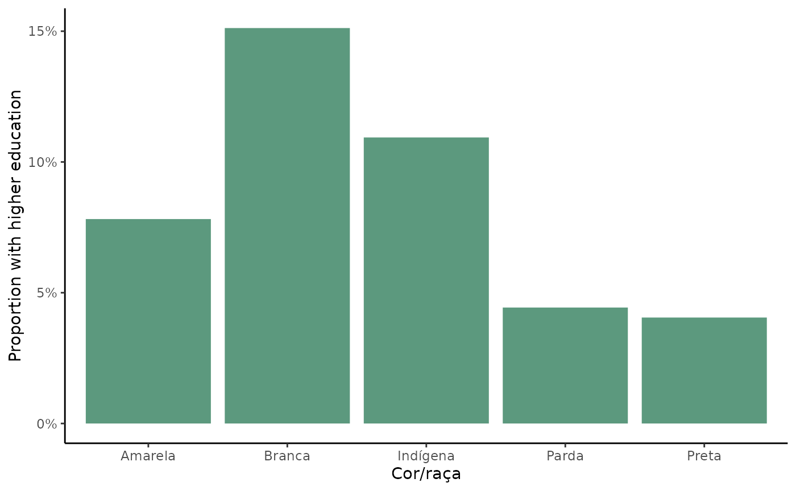
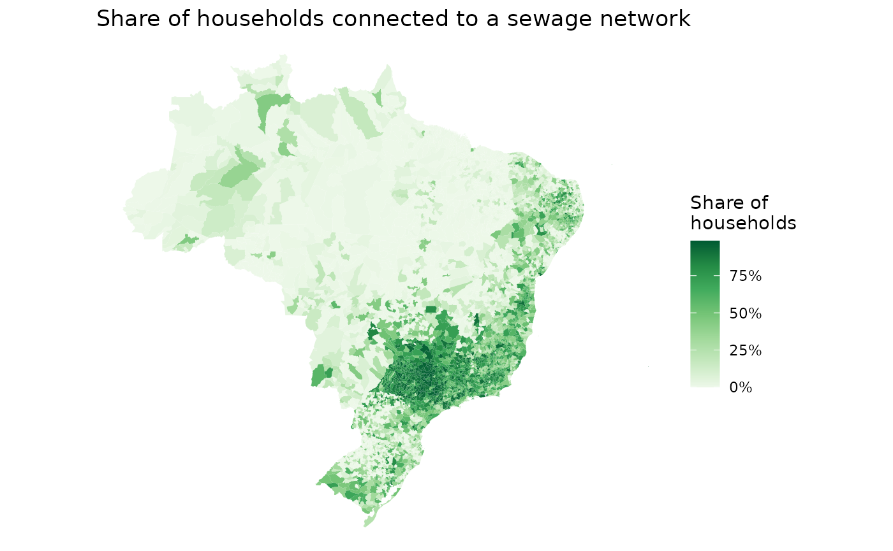
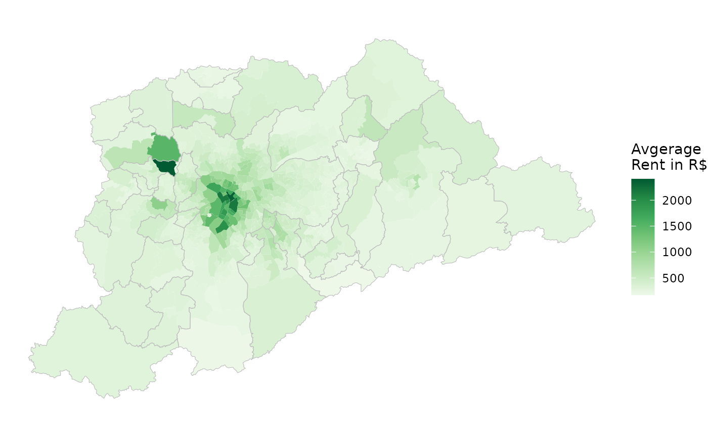

# Introduction to censobr

**{censobr}** is an R package to download data from Brazil’s Population
Census. It provides a very simple and efficient way to download and read
the data sets and documentation of all the population censuses taken in
and after 1960 in the country. The **{censobr}** package is built on top
of the [Arrow platform](https://arrow.apache.org/docs/r/), which allows
users to work with larger-than-memory census data using [{dplyr}
familiar
functions](https://arrow.apache.org/docs/r/articles/arrow.html#analyzing-arrow-data-with-dplyr).

## Installation

``` r
# install from CRAN
install.packages("censobr")

# or use the development version with latest features
utils::remove.packages('censobr')
remotes::install_github("ipeaGIT/censobr", ref="dev")
```

## Basic usage

The package currently includes 6 main functions to download census data:

1.  [`read_population()`](https://ipeagit.github.io/censobr/dev/reference/read_population.md)
2.  [`read_households()`](https://ipeagit.github.io/censobr/dev/reference/read_households.md)
3.  [`read_mortality()`](https://ipeagit.github.io/censobr/dev/reference/read_mortality.md)
4.  [`read_families()`](https://ipeagit.github.io/censobr/dev/reference/read_families.md)
5.  [`read_emigration()`](https://ipeagit.github.io/censobr/dev/reference/read_emigration.md)
6.  [`read_tracts()`](https://ipeagit.github.io/censobr/dev/reference/read_tracts.md)

| Função            | Origem   | Unidade          | Definição                                                  | Disponibilidade |     |     |     |      |     |            |
|-------------------|----------|------------------|------------------------------------------------------------|-----------------|-----|-----|-----|------|-----|------------|
|                   |          |                  |                                                            | 1960            | 70  | 80  | 91  | 2000 | 10  | 22         |
| read_population() | Amostra  | Microdado        | Lê os microdados de pessoas.                               | X               | X   | X   | X   |      | X   | *em breve* |
| read_households() | Amostra  | Microdado        | Lê os microdados de domicílios.                            | X               | X   | X   | X   | X    | X   | *em breve* |
| read_families()   | Amostra  | Microdado        | Lê os microdados de famílias do censo de 2000.             |                 |     |     | X   |      |     |            |
| read_emigration() | Amostra  | Microdado        | Lê os microdados de emigração.                             |                 |     |     |     | X    |     | *em breve* |
| read_mortality()  | Amostra  | Microdado        | Lê os microdados de mortalidade.                           |                 |     |     |     |      | X   | *em breve* |
| read_tracts()     | Universo | Setor Censitário | Lê os dados do Universo agregados por setores censitários. |                 |     |     |     | *X*  | X   | *X*        |

**{censobr}** also includes a few support functions to help users
navigate the documentation Brazilian censuses, providing convenient
information on data variables and methodology.:

7.  [`data_dictionary()`](https://ipeagit.github.io/censobr/dev/reference/data_dictionary.md)
8.  [`questionnaire()`](https://ipeagit.github.io/censobr/dev/reference/questionnaire.md)
9.  [`interview_manual()`](https://ipeagit.github.io/censobr/dev/reference/interview_manual.md)

Finally, the package includes a function to help users to manage the
data cached locally.

10. [`censobr_cache()`](https://ipeagit.github.io/censobr/dev/reference/censobr_cache.md)

The syntax of all **{censobr}** functions to read data operate on the
same logic so it becomes intuitive to download any data set using a
single line of code. Like this:

``` r
read_households(
  year,          # year of reference
  columns,       # select columns to read
  add_labels,    # add labels to categorical variables
  as_data_frame, # return an Arrow DataSet or a data.frame
  showProgress,  # show download progress bar
  cache,         # cache data for faster access later
  verbose        # whether to print informative messages
  )
```

***Note:*** all data sets in **{censobr}** are enriched with geography
columns following the name standards of the [{geobr}
package](https://github.com/ipeaGIT/geobr/) to help data manipulation
and integration with spatial data from {geobr}. The added columns are:
`c(‘code_muni’, ‘code_state’, ‘abbrev_state’, ‘name_state’, ‘code_region’, ‘name_region’, ‘code_weighting’)`.

***Data Cache:***

The first time the user runs a function, **{censobr}** will download the
file and store it locally. This way, the data only needs to be
downloaded once. More info in the [Data cache
section](https://ipeagit.github.io/censobr/articles/censobr.html#data-cache)
below.

## Larger-than-memory Data

Data of Brazilian censuses are often too big to load in users’ RAM
memory. To avoid this problem, **{censobr}** will by default return an
[Arrow
table](https://arrow.apache.org/docs/r/articles/arrow.html#tabular-data-in-arrow),
which can be analyzed like a regular `data.frame` using the `dplyr`
package without loading the full data to memory.

Let’s see how **{censobr}** works in a couple examples:

## Reproducible examples

First, let’s load the libraries we’ll be using in this vignette.

``` r
library(censobr)
library(arrow)
library(dplyr)
library(ggplot2)
```

#### Using Population data:

In this example we’ll be calculating the proportion of people with
higher education in different racial groups in the state of Rio de
Janeiro. First, we need to use the
[`read_population()`](https://ipeagit.github.io/censobr/dev/reference/read_population.md)
function to download the population data set.

Since we don’t need to load to memory all columns from the data, we can
pass a vector with the names of the columns we’re going to use. This
might be necessary in more constrained computing environments. Note that
by setting `add_labels = 'pt'`, the function returns labeled values for
categorical variables.

``` r
pop <- read_population(
  year = 2010,
  columns = c('abbrev_state', 'V0606', 'V0010', 'V6400'),
  add_labels = 'pt',
  showProgress = FALSE
  )

class(pop)
#> [1] "arrow_dplyr_query"
```

By default, the output of the function is an `"arrow_dplyr_query"`. This
is makes it possible for you to work with the census data in a super
fast and efficient way, even though the data set might be to big for
your computer memory. By setting the parameter `as_data_frame = TRUE`,
the read functions load the entire output to memory as a `data.frame`.
*Warning:* This can cause the R session to crash in computationally
constrained environments.

The output of the read functions in **{censobr}** can be analyzed like a
regular `data.frame` using the [dplyr](https://dplyr.tidyverse.org)
package. For example, one can have a quick peak into the data set with
[`glimpse()`](https://pillar.r-lib.org/reference/glimpse.html)

``` r
dplyr::glimpse(pop)
#> FileSystemDataset with 1 Parquet file (query)
#> 20,635,472 rows x 4 columns
#> $ abbrev_state <string> "RO", "RO", "RO", "RO", "RO", "RO", "RO", "RO", "RO", "R…
#> $ V0606        <string> "Parda", "Parda", "Branca", "Branca", "Parda", "Parda", …
#> $ V0010        <double> 8.705865, 8.705865, 9.818689, 9.495608, 9.495608, 9.4956…
#> $ V6400        <string> "Sem instrução e fundamental incompleto", "Sem instrução…
#> Call `print()` for query details
```

In the example below, we use the `dplyr` syntax to (a) filter
observations for the state of Rio de Janeiro, (b) group observations by
racial group, (c) summarize the data calculating the proportion of
individuals with higher education. Note that we need to add a
[`collect()`](https://dplyr.tidyverse.org/reference/compute.html) call
at the end of our query.

``` r
df <- pop |>
      filter(abbrev_state == "RJ") |>                                                    # (a)
      compute() |>
      group_by(V0606) |>                                                                 # (b)
      summarize(higher_edu = sum(V0010[which(V6400=="Superior completo")]) / sum(V0010), # (c)
                pop = sum(V0010) ) |>
      collect()

head(df)
#> # A tibble: 6 × 3
#>   V0606    higher_edu      pop
#>   <chr>         <dbl>    <dbl>
#> 1 Amarela      0.0782  122552.
#> 2 Branca       0.151  7579023.
#> 3 Ignorado     0         3397.
#> 4 Indígena     0.109    15258.
#> 5 Parda        0.0443 6332408.
#> 6 Preta        0.0405 1937291.
```

Now we only need to plot the results.

``` r
df <- subset(df, V0606 != 'Ignorado')

ggplot() +
  geom_col(data = df, aes(x=V0606, y=higher_edu), fill = '#5c997e') +
  scale_y_continuous(name = 'Proportion with higher education',
                     labels = scales::percent) +
  labs(x = 'Cor/raça') +
  theme_classic()
```



#### Using household data:

##### Sewage coverage:

In this example, we are going to map the proportion of households
connected to a sewage network in Brazilian municipalities First, we can
easily download the households data set with the
[`read_households()`](https://ipeagit.github.io/censobr/dev/reference/read_households.md)
function.

``` r
hs <- read_households(
  year = 2010, 
  showProgress = FALSE
  )
```

Now we’re going to (a) group observations by municipality, (b) get the
number of households connected to a sewage network, (c) calculate the
proportion of households connected, and (d) collect the results.

``` r
esg <- hs |> 
        compute() |>
        group_by(code_muni) |>                                             # (a)
        summarize(rede = sum(V0010[which(V0207=='1')]),                    # (b)
                  total = sum(V0010)) |>                                   # (b)
        mutate(cobertura = rede / total) |>                                # (c)
        collect()                                                          # (d)

head(esg)
#> # A tibble: 6 × 4
#>   code_muni     rede  total cobertura
#>       <int>    <dbl>  <dbl>     <dbl>
#> 1   1100015     0     7443.   0      
#> 2   1100023   182.   27654.   0.00660
#> 3   1100031     0     1979.   0      
#> 4   1100049 10019.   24413.   0.410  
#> 5   1100056     5.81  5399    0.00108
#> 6   1100064    28.9   6013.   0.00480
```

In order to create a map with these values, we are going to use the
[{geobr} package](https://ipeagit.github.io/geobr/) to download the
geometries of Brazilian municipalities.

``` r
library(geobr)

muni_sf <- geobr::read_municipality(
  year = 2010,
  showProgress = FALSE
  )

head(muni_sf)
#> Simple feature collection with 6 features and 4 fields
#> Geometry type: MULTIPOLYGON
#> Dimension:     XY
#> Bounding box:  xmin: -63.61822 ymin: -13.6937 xmax: -60.33317 ymax: -9.66916
#> Geodetic CRS:  SIRGAS 2000
#>   code_muni             name_muni code_state abbrev_state
#> 1   1100015 Alta Floresta D'oeste         11           RO
#> 2   1100023             Ariquemes         11           RO
#> 3   1100031                Cabixi         11           RO
#> 4   1100049                Cacoal         11           RO
#> 5   1100056            Cerejeiras         11           RO
#> 6   1100064     Colorado Do Oeste         11           RO
#>                             geom
#> 1 MULTIPOLYGON (((-62.2462 -1...
#> 2 MULTIPOLYGON (((-63.13712 -...
#> 3 MULTIPOLYGON (((-60.52408 -...
#> 4 MULTIPOLYGON (((-61.42679 -...
#> 5 MULTIPOLYGON (((-61.41347 -...
#> 6 MULTIPOLYGON (((-60.66352 -...
```

Now we only need to merge the spatial data with our estimates and map
the results.

``` r
esg_sf <- left_join(muni_sf, esg, by = 'code_muni')

ggplot() +
  geom_sf(data = esg_sf, aes(fill = cobertura), color=NA) +
  labs(title = "Share of households connected to a sewage network") +
  scale_fill_distiller(palette = "Greens", direction = 1, 
                       name='Share of\nhouseholds', 
                       labels = scales::percent) +
  theme_void()
```



##### Spatial distribution of rents:

In this final example, we’re going to visualize how the amount of money
people spend on rent varies spatially across the metropolitan area of
São Paulo.

First, let’s download the municipalities of the metro area of São Paulo.

``` r
metro_muni <- geobr::read_metro_area(
  year = 2010, 
  showProgress = FALSE) |>
  subset(name_metro == "RM São Paulo")
```

We also need the polygons of the weighting areas (áreas de ponderação).
With the code below, we download all weighting areas in the state of São
Paulo, and then keep only the ones in the metropolitan region of São
Paulo.

``` r
wt_areas <- geobr::read_weighting_area(
  code_weighting = "SP", 
  showProgress = FALSE,
  year = 2010
  )

wt_areas <- subset(wt_areas, code_muni %in% metro_muni$code_muni)
head(wt_areas)
#> Simple feature collection with 6 features and 7 fields
#> Geometry type: MULTIPOLYGON
#> Dimension:     XY
#> Bounding box:  xmin: -46.73454 ymin: -23.64487 xmax: -46.64756 ymax: -23.53528
#> Geodetic CRS:  SIRGAS 2000
#>    code_weighting code_muni name_muni code_state abbrev_state code_region
#> 5   3550308005100   3550308 São Paulo         35           SP           3
#> 6   3550308005102   3550308 São Paulo         35           SP           3
#> 8   3550308005101   3550308 São Paulo         35           SP           3
#> 10  3550308005104   3550308 São Paulo         35           SP           3
#> 12  3550308005103   3550308 São Paulo         35           SP           3
#> 14  3550308005106   3550308 São Paulo         35           SP           3
#>    name_region                           geom
#> 5      Sudeste MULTIPOLYGON (((-46.67201 -...
#> 6      Sudeste MULTIPOLYGON (((-46.67663 -...
#> 8      Sudeste MULTIPOLYGON (((-46.67257 -...
#> 10     Sudeste MULTIPOLYGON (((-46.70138 -...
#> 12     Sudeste MULTIPOLYGON (((-46.69581 -...
#> 14     Sudeste MULTIPOLYGON (((-46.73454 -...
```

Now we need to calculate the average rent spent in each weighting area.
Using the national household data set, we’re going to (a) filter only
observations in our municipalities of interest, (b) group observations
by weighting area, (c) calculate the average rent, and (d) collect the
results.

``` r
rent <- hs |>
        filter(code_muni %in% metro_muni$code_muni) |>                     # (a)
        compute() |>
        group_by(code_weighting) |>                                        # (b)
        summarize(avgrent=weighted.mean(x=V2011, w=V0010, na.rm=TRUE)) |>  # (c)
        collect()                                                          # (d)

head(rent)
#> # A tibble: 6 × 2
#>   code_weighting avgrent
#>   <chr>            <dbl>
#> 1 3503901003001     355.
#> 2 3503901003002     627.
#> 3 3503901003003     358.
#> 4 3505708005001     577.
#> 5 3505708005002     397.
#> 6 3505708005003     327.
```

Finally, we can merge the spatial data with our rent estimates and map
the results.

``` r
rent_sf <- left_join(wt_areas, rent, by = 'code_weighting')

ggplot() +
  geom_sf(data = rent_sf, aes(fill = avgrent), color=NA) +
  geom_sf(data = metro_muni, color='gray', fill=NA) +
  scale_fill_distiller(palette = "Greens", direction = 1, 
                       name='Avgerage\nRent in R$') +
  theme_void()
```



### Data cache

The first time the user runs a function, **{censobr}** will download the
file and store it locally. This way, the data only needs to be
downloaded once. When the `cache` parameter is set to `TRUE` (Default),
the function will read the cached data, which is much faster.

Users can manage the cached data sets using the
[`censobr_cache()`](https://ipeagit.github.io/censobr/dev/reference/censobr_cache.md)
function. For example, users can:

List cached files in tree format:

``` r
censobr::censobr_cache(
  list_files = TRUE, 
  print_tree = TRUE
  )
```

Delete a particular file:

``` r
censobr::censobr_cache(delete_file = "2010_emigration")
```

Delete all files:

``` r
censobr::censobr_cache(delete_file = "all")
```

By default, **{censobr}** files are saved in the ‘User’ directory.
However, users can run the function
[`set_censobr_cache_dir()`](https://ipeagit.github.io/censobr/dev/reference/set_censobr_cache_dir.md)
to set custom cache directory. This directory is persistent across R
sessions.

``` r
tempf <- fs::path_temp(pattern = "my_temp_dir")

censobr::set_censobr_cache_dir(path = tempf)
#> ℹ censobr files will be cached at
#> /tmp/RtmpQKpoLI/my_temp_dir.
```

Mind you that the data is saved in a directory inside the cache
directory set by the user and which is versioned according to the
version of the latest data release.

``` r
# download file to our new cache dir
df_emi <- censobr::read_emigration(year = 2010)

# check files in current cache dir
censobr::censobr_cache(
  list_files = TRUE, 
  print_tree = TRUE
  )
#> /tmp/RtmpQKpoLI/my_temp_dir
#> └── data_release_v0.5.0
#>     └── 2010_emigration_v0.5.0.parquet
```

If you do not remember the location of the cache, you can always run
[`get_censobr_cache_dir()`](https://ipeagit.github.io/censobr/dev/reference/get_censobr_cache_dir.md)
to return the path of the cache directory in use, or run
`set_censobr_cache_dir(path = NULL)` to set the default cache directory
back.
